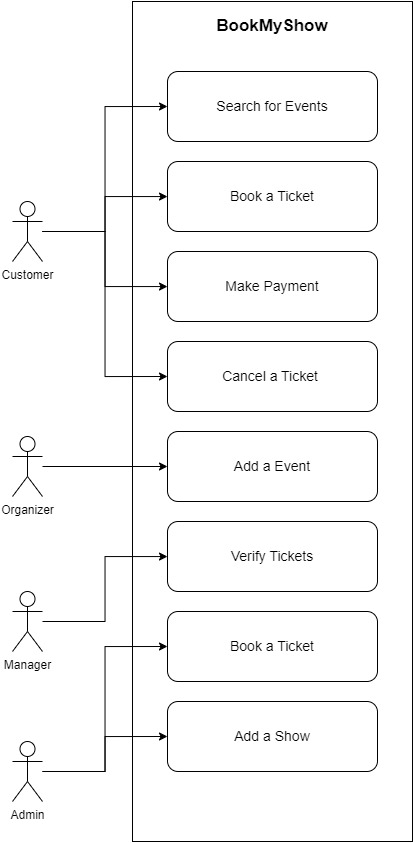

# BookMyShow Django Project
___
This project is made to practice low level design, algorithms and ofcourse django framework.

## Problem Statement
___
- An event ticket booking system to book seats for movies, theaters, and stadiums.
- The project has to have a class diagram, schema diagram, and machine coding.
- It has to be a backend server only for now.
- The data has to persist in the Database.
- The project should have API routes, not just MVC.
- For now, no need to connect to third-party APIs, keep it a dummy functionality

## Requirements
___
- There will be 4 user types: customer, event organizer, event manager, and admin. Each user has its own set of controls.
- The customer can:
    - Search for events over the app, can filter by event type (movie, theater, match)
    - It can select an event and check its details such as type, title, casts, date, time, seat map, location, seat-wise cost, and minimum cost.
    - Book a ticket, for multiple people, make payments, create tickets, and manage observer.
    - Option to cancel the ticket and manage the observer.
- The event organizer can:
    - Create an event in the app; adding type, title, seating plan, seat-wise cost, date, time, payment account, and event managers
- The event manager can:
    - Verify customer in the event.
- The admin can:
    - Can edit or add on behalf of customers and organizers.
- Movies and acts can have the same theater structure whereas match happens in stadiums.

## Use Case Diagram
___


## Commands to Run
- Make sure you have python 3.12.x and MySQL installed in your system.
- Open terminal and clone the repository `git clone https://github.com/mazumdarsoubhik/BookMyShow-Django-Backend.git`
- Navigate to the repository `cd BookMyShow-Django-Backend`
- Make migrations to manage DB:
  - `python manage.py makemigrations`
  - `python manage.py migrate`
- Run server `python manage.py runserver`

## API Documentation
___
List of APIs:
- 


### Login
<div style="background-color: #f0f0f0; border: 1px solid #ccc; padding: 10px; margin-left: 20px;">
Used to collect a Token for a registered User.

**URL** : `/api/login/`

**Method** : `POST`

**Auth required** : NO

**Data constraints**

```json
{
    "username": "[valid email address]",
    "password": "[password in plain text]"
}
```

**Data example**

```json
{
    "username": "iloveauth@example.com",
    "password": "abcd1234"
}
```

### Success Response

**Code** : `200 OK`

**Content example**

```json
{
    "token": "93144b288eb1fdccbe46d6fc0f241a51766ecd3d"
}
```

## Error Response

**Condition** : If 'username' and 'password' combination is wrong.

**Code** : `400 BAD REQUEST`

**Content** :

```json
{
    "non_field_errors": [
        "Unable to login with provided credentials."
    ]
}
```
</div>
---

# Add City

To add city in DB.

**URL** : `/city/`

**Method** : `POST`

**Auth required** : YES - Admin

**Data constraints**

```json
{
    "name": "[Name of the City]"
}
```

**Data example**

```json
{
    "name": "Ahmedabad"
}
```

## Success Response

**Code** : `200 OK`

**Content example**

```json
{
    "id": 10,
    "created_at": "2024-04-22T13:00:01.588654Z",
    "modified_at": "2024-04-22T13:00:01.588654Z",
    "name": "Ahmedabad"
}
```

## Error Response

**Condition** : If 'city' already exists.

**Code** : `204 NO CONTENT`

**Content** :

```json
{
    "message": "City Already exists."
}
```

---

---

# Get City

To add city in DB.

**URL** : `/city/`

**Method** : `GET`

**Auth required** : YES

## Success Response

**Code** : `200 OK`

**Content example**

```json
[
    {
        "id": 1,
        "created_at": "2024-04-15T17:59:14.451044Z",
        "modified_at": "2024-04-15T17:59:14.451044Z",
        "name": "Bangalore"
    },
    {
        "id": 2,
        "created_at": "2024-04-15T17:59:45.554186Z",
        "modified_at": "2024-04-15T17:59:45.554186Z",
        "name": "Chennai"
    }
    
]
```

## Error Response

**Condition** : If user not authorized to use the API.

**Code** : `401 UNAUTHORIZED`

**Content** :

```json
{
    "message": "You do not have access to this API."
}
```

---

# Add Movie

To add movie in DB.

**URL** : `/movie/`

**Method** : `POST`

**Auth required** : YES - Admin

**Data constraints**

```json
{
  "title": "Example Movie",
  "description": "This is an example movie description.",
  "release_date": "YYYY-MM-DD",
  "rating": 8,
  "movieCategory": "ACTION",
  "casts": [1, 2, 3], 
  "languages": [1, 2]  
}
```

Movie Category Enum
```python
class MovieCategory(models.TextChoices):
    ACTION = "ACTION"
    DRAMA = "DRAMA"
    HORROR = "HORROR"
    COMEDY = "COMEDY"
```

**Data example**

```json
{
  "title": "Dunki",
  "description": "A bollywood movie on illegal immigration.",
  "release_date": "2024-04-23",
  "rating": 8,
  "movieCategory": "DRAMA",
  "casts": [2, 3, 4], 
  "languages": [1, 2]  
}
```

## Success Response

**Code** : `200 OK`

**Content example**

```json
{
    "id": 1,
    "created_at": "2024-04-23T11:29:24.318229Z",
    "modified_at": "2024-04-23T11:29:24.318229Z",
    "title": "Dunki",
    "description": "A bollywood movie on illegal immigration.",
    "release_date": "2024-04-23",
    "rating": 8,
    "movieCategory": "DRAMA",
    "casts": [
        2,
        3,
        4
    ],
    "languages": [
        1,
        2
    ]
}
```

## Error Response

**Condition** : If 'movie' already exists.

**Code** : `204 NO CONTENT`

**Content** :

```json
{
    "message": "Movie Already exists."
}
```

---